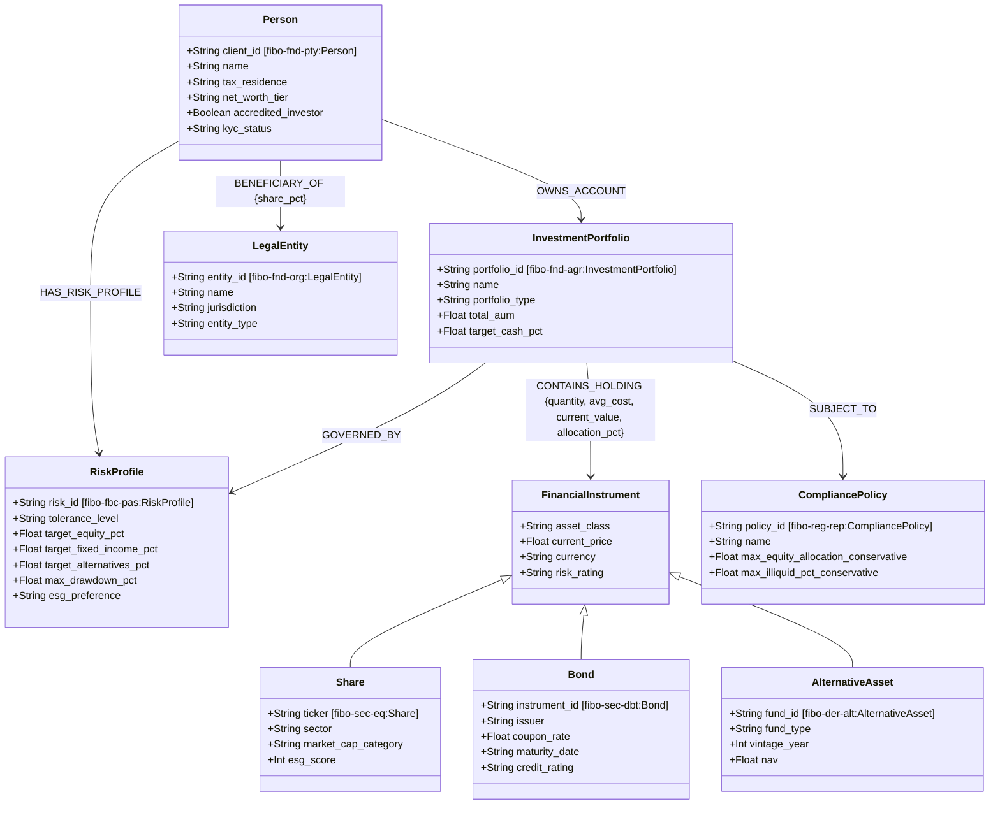
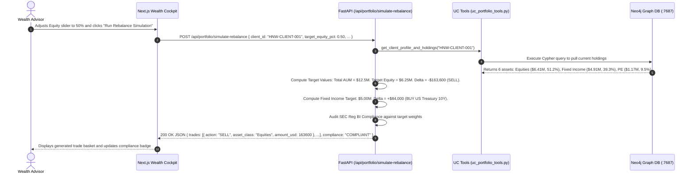

# AURA Wealth IQ: Deep Domain, Cypher Query & Codebase Master Reference
> **The Exhaustive, Line-by-Line Technical and Financial Ontology Guide.**  
> *Everything you need to master, explain, defend, and expand this platform.*

---

## 📑 Detailed Table of Contents

1. [Financial Domain Fundamentals: Wealth Management & Ontology](#1-financial-domain-fundamentals-wealth-management--ontology)
   - 1.1 High-Net-Worth (HNW) vs. Ultra-HNW (UHNW) Dynamics
   - 1.2 Investment Policy Statements (IPS) & Risk Mandates
   - 1.3 Regulatory Frameworks: SEC Regulation Best Interest (Reg BI) & MiFID II
   - 1.4 Estate Planning & Trust Structures (Delaware Trust Nexus)
2. [Why Graph RAG Beats Vector Search in Financial Advisory](#2-why-graph-rag-beats-vector-search-in-financial-advisory)
3. [FIBO (Financial Industry Business Ontology) Model Specification](#3-fibo-financial-industry-business-ontology-model-specification)
4. [Line-by-Line Breakdown of Every Cypher Query](#4-line-by-line-breakdown-of-every-cypher-query)
   - 4.1 Schema Constraints & Performance Indexes (`fibo_constraints.cypher`)
   - 4.2 Knowledge Graph Seed Scripts (`fibo_seed_wealth.cypher`)
   - 4.3 Tool Query 1: `get_client_profile_and_holdings`
   - 4.4 Tool Query 2: `check_portfolio_risk_suitability`
   - 4.5 Tool Query 3: `find_correlated_exposure`
   - 4.6 Tool Query 4: `analyze_client_tax_and_trust_structure`
   - 4.7 Tool Query 5: Interactive Cypher Studio Template Queries
5. [End-to-End Codebase Walkthrough](#5-end-to-end-codebase-walkthrough)
   - 5.1 Connection Pooling (`backend/src/db/neo4j_client.py`)
   - 5.2 Databricks Unity Catalog Standards (`backend/src/tools/uc_portfolio_tools.py`)
   - 5.3 Model Context Protocol FastMCP Server (`backend/src/mcp_server/server.py`)
   - 5.4 Multi-Hop Agentic RAG Engine (`backend/src/agent/agentic_rag.py`)
   - 5.5 FastAPI REST Bridge (`backend/src/api/app.py`)
   - 5.6 Next.js Institutional Frontend Components (`frontend/`)
6. [Complete Step-by-Step Request Execution Lifecycle](#6-complete-step-by-step-request-execution-lifecycle)
7. [Comprehensive Pitch, Defense & Interview Guide](#7-comprehensive-pitch-defense--interview-guide)

---

## 1. Financial Domain Fundamentals: Wealth Management & Ontology

### 1.1 High-Net-Worth (HNW) vs. Ultra-HNW (UHNW) Dynamics
In institutional wealth management, clients are categorized by investable liquid assets:
- **High-Net-Worth (HNW)**: \$1M to \$10M in investable assets (e.g. *Marcus Thorne* in our database with \$6.0M AUM). Their focus is typically capital preservation, steady yield, tax efficiency, and retirement income.
- **Ultra-High-Net-Worth (UHNW)**: \$25M+ in investable assets (e.g. *Victoria Sterling* in our database with \$12.5M in managed liquid flagship portfolios and \$25M+ net worth). UHNW accounts involve multi-asset growth, private equity allocations, family offices, and complex multi-entity trust structures.

---

### 1.2 Investment Policy Statements (IPS) & Risk Mandates
Every managed wealth account is legally bound by an **Investment Policy Statement (IPS)** and a **Risk Profile Mandate**:
- **Target Asset Allocation**: The strategic percentage split across asset classes (e.g. 60% Equities, 30% Fixed Income, 10% Alternative Assets).
- **Maximum Drawdown**: The maximum acceptable peak-to-trough decline (e.g. 18% for Moderate Growth, 8% for Conservative Capital Preservation).
- **Asset Allocation Drift**: Over time, market movements cause asset weights to shift away from the mandate (e.g. a tech stock rally increases equity weight to 68%). When drift exceeds $\pm 5\%$, advisors must trigger a **Portfolio Rebalancing**.

---

### 1.3 Regulatory Frameworks: SEC Regulation Best Interest (Reg BI) & MiFID II
Financial advisors operate under strict legal supervisory standards:
- **SEC Regulation Best Interest (Reg BI)**: Requires broker-dealers and registered investment advisors (RIAs) to only recommend investments that strictly match the client's explicit risk profile, time horizon, and liquidity needs. For a client categorized as *Conservative Capital Preservation*, placing more than 35% of their capital in volatile equities triggers a regulatory non-compliance violation.
- **MiFID II Suitability Directive**: European standard requiring explicit ESG preference capture and suitability scoring before executing discretionary trades.

---

### 1.4 Estate Planning & Trust Structures (Delaware Trust Nexus)
UHNW clients rarely hold major assets in their individual personal names due to estate taxes and liability. Instead, they utilize **Irrevocable Dynasty Trusts**:
- In our graph, Victoria Sterling is the 100% beneficiary of **The Sterling Dynasty Irrevocable Trust** registered in **Delaware (`US-DE`)**.
- **Why Delaware?** Delaware has no state income tax on non-resident beneficiaries, allows perpetual dynasty trusts (no rule against perpetuities), and offers strong statutory asset protection against civil judgments.

---

## 2. Why Graph RAG Beats Vector Search in Financial Advisory

| Feature | Standard Vector RAG (Embeddings) | FIBO Graph RAG (AURA Wealth IQ) |
| :--- | :--- | :--- |
| **Relational Arithmetic** | ❌ Fails. Cannot calculate portfolio percentage weights or aggregate AUM. | ✅ Exact. Executes mathematical Cypher aggregations on exact holding quantities and prices. |
| **Multi-Hop Traversal** | ❌ Fails. Cannot link Client $\to$ Trust $\to$ Account $\to$ Equity $\to$ Risk Mandate $\to$ Rule. | ✅ Native. Traverses $N$-degree pointer relationships in sub-milliseconds. |
| **Regulatory Determinism** | ❌ Hallucinates unstructured opinions. | ✅ Deterministic. Compares actual allocation numbers directly against hardcoded policy thresholds (`POL-REG-BI-2024`). |
| **Explainability & Auditing** | ❌ Black box text generation. | ✅ Transparent. Emits verifiable Cypher queries, tool logs, and MLflow-compatible reasoning traces. |

---

## 3. FIBO (Financial Industry Business Ontology) Model Specification

Our Neo4j database strictly adopts the **EDMC FIBO standard** ontology classes:



---

## 4. Line-by-Line Breakdown of Every Cypher Query

### 4.1 Schema Constraints & Performance Indexes (`backend/schema/fibo_constraints.cypher`)

```cypher
// 1. Uniqueness Constraint on Client Person ID
CREATE CONSTRAINT client_id_unique IF NOT EXISTS
FOR (c:`fibo-fnd-pty:Person`) REQUIRE c.client_id IS UNIQUE;
```
- **What it does**: Enforces that no two client nodes can share the same `client_id` (e.g. `HNW-CLIENT-001`).
- **Why it matters**: In graph databases, uniqueness constraints automatically generate an underlying B-Tree index. This allows $O(1)$ constant-time node discovery before pointer traversals.

```cypher
// 2. Uniqueness Constraints on Portfolios, Instruments, and Risk Profiles
CREATE CONSTRAINT portfolio_id_unique IF NOT EXISTS
FOR (p:`fibo-fnd-agr:InvestmentPortfolio`) REQUIRE p.portfolio_id IS UNIQUE;

CREATE CONSTRAINT instrument_ticker_unique IF NOT EXISTS
FOR (s:`fibo-sec-eq:Share`) REQUIRE s.ticker IS UNIQUE;

CREATE CONSTRAINT bond_id_unique IF NOT EXISTS
FOR (b:`fibo-sec-dbt:Bond`) REQUIRE b.instrument_id IS UNIQUE;
```
- **What it does**: Ensures ticker symbols (`AAPL`, `MSFT`) and bond identifiers are globally unique across the entire wealth management system.

```cypher
// 3. Performance Lookup Indexes
CREATE INDEX client_name_idx IF NOT EXISTS
FOR (c:`fibo-fnd-pty:Person`) ON (c.name);

CREATE INDEX share_sector_idx IF NOT EXISTS
FOR (s:`fibo-sec-eq:Share`) ON (s.sector);
```
- **What it does**: Creates index trees on client names and instrument sectors.
- **Why it matters**: Enables instant searches like `WHERE s.sector = 'Technology'` without performing full table scans across millions of holdings.

---

### 4.2 Knowledge Graph Seed Scripts (`backend/schema/fibo_seed_wealth.cypher`)

#### Step 1: Regulatory Compliance Policies
```cypher
MERGE (reg_bi:CompliancePolicy:`fibo-reg-rep:CompliancePolicy` {policy_id: "POL-REG-BI-2024"})
SET reg_bi.name = "SEC Regulation Best Interest Standard",
    reg_bi.max_equity_allocation_conservative = 0.35,
    reg_bi.max_illiquid_pct_conservative = 0.05,
    reg_bi.min_fixed_income_conservative = 0.50;
```
- **`MERGE`**: Checks if a node with `policy_id = "POL-REG-BI-2024"` exists. If not, it creates it idempotently.
- **Dual Labeling**: Sets both a simplified label (`:CompliancePolicy`) and the formal FIBO URI label (`:`fibo-reg-rep:CompliancePolicy``).
- **Properties**: Sets statutory thresholds: Conservative portfolios may not hold more than 35% equity or 5% illiquid assets.

#### Step 2: Financial Instruments (Equities, Bonds, Alternatives)
```cypher
MERGE (aapl:Share:FinancialInstrument:`fibo-sec-eq:Share` {ticker: "AAPL"})
SET aapl.name = "Apple Inc. Common Stock",
    aapl.sector = "Technology",
    aapl.asset_class = "Equity",
    aapl.market_cap_category = "MegaCap",
    aapl.esg_score = 82,
    aapl.current_price = 224.50,
    aapl.currency = "USD",
    aapl.risk_rating = "Moderate";
```
- **Hierarchical Labels**: A single node is labeled `:Share`, `:FinancialInstrument`, and `fibo-sec-eq:Share`. This allows queries to match by specific type (`MATCH (s:Share)`) or polymorphic supertype (`MATCH (i:FinancialInstrument)`).

```cypher
MERGE (ust10y:Bond:FinancialInstrument:`fibo-sec-dbt:Bond` {instrument_id: "BOND-UST-10Y-2034"})
SET ust10y.name = "US Treasury 10-Year Benchmark Bond",
    ust10y.issuer = "US Department of the Treasury",
    ust10y.coupon_rate = 0.0425,
    ust10y.maturity_date = "2034-08-15",
    ust10y.credit_rating = "AAA",
    ust10y.asset_class = "FixedIncome",
    ust10y.current_price = 99.40,
    ust10y.currency = "USD",
    ust10y.risk_rating = "Low";
```
- Defines fixed income parameters: `coupon_rate: 0.0425` (4.25% annual yield), `credit_rating: AAA`, maturity date in 2034.

#### Step 3: High-Net-Worth Client 1 (Victoria Sterling) & Estate Entities
```cypher
MERGE (c1:Person:`fibo-fnd-pty:Person` {client_id: "HNW-CLIENT-001"})
SET c1.name = "Victoria Sterling",
    c1.tax_residence = "US-NY",
    c1.net_worth_tier = "Ultra-HNW ($25M+)",
    c1.accredited_investor = true,
    c1.kyc_status = "VERIFIED_TIER1",
    c1.created_date = "2021-03-15";

MERGE (rp1:RiskProfile:`fibo-fbc-pas:RiskProfile` {risk_id: "RP-STERLING-01"})
SET rp1.tolerance_level = "Moderate Growth",
    rp1.time_horizon_years = 12,
    rp1.liquidity_need = "Low",
    rp1.max_drawdown_pct = 0.18,
    rp1.target_equity_pct = 0.60,
    rp1.target_fixed_income_pct = 0.30,
    rp1.target_alternatives_pct = 0.10,
    rp1.esg_preference = "High";

MERGE (e1:LegalEntity:`fibo-fnd-org:LegalEntity` {entity_id: "TRUST-STERLING-DYNASTY"})
SET e1.name = "The Sterling Dynasty Irrevocable Trust",
    e1.jurisdiction = "US-DE",
    e1.entity_type = "IrrevocableTrust";

MERGE (p1:InvestmentPortfolio:`fibo-fnd-agr:InvestmentPortfolio` {portfolio_id: "PORT-VS-GROWTH-01"})
SET p1.name = "Sterling Flagship Discretionary Growth",
    p1.portfolio_type = "Discretionary",
    p1.currency = "USD",
    p1.total_aum = 12500000.0,
    p1.target_cash_pct = 0.05;
```
- Sets up Victoria Sterling's investment universe: \$12.5M AUM, Moderate Growth mandate (60% Equity target, max drawdown 18%), and connected to *The Sterling Dynasty Irrevocable Trust* in Delaware.

#### Step 4: Relational Graph Links & Holding Weights
```cypher
MATCH (c:Person {client_id: "HNW-CLIENT-001"}), (rp:RiskProfile {risk_id: "RP-STERLING-01"})
MERGE (c)-[:HAS_RISK_PROFILE]->(rp);

MATCH (c:Person {client_id: "HNW-CLIENT-001"}), (e:LegalEntity {entity_id: "TRUST-STERLING-DYNASTY"})
MERGE (c)-[:BENEFICIARY_OF {share_pct: 1.0}]->(e);

MATCH (c:Person {client_id: "HNW-CLIENT-001"}), (p:InvestmentPortfolio {portfolio_id: "PORT-VS-GROWTH-01"})
MERGE (c)-[:OWNS_ACCOUNT]->(p);

MATCH (p:InvestmentPortfolio {portfolio_id: "PORT-VS-GROWTH-01"}), (aapl:Share {ticker: "AAPL"})
MERGE (p)-[:CONTAINS_HOLDING {quantity: 12000, avg_cost: 185.00, current_value: 2694000.0, allocation_pct: 0.215}]->(aapl);
```
- **`CONTAINS_HOLDING` Edge Properties**:
  - `quantity: 12000`: Shares held.
  - `avg_cost: 185.00`: Acquisition price for tax basis accounting.
  - `current_value: 2694000.0`: $12,000 \times \$224.50 = \$2,694,000$.
  - `allocation_pct: 0.215`: $\$2,694,000 / \$12,500,000 = 21.54\%$.

---

### 4.3 Tool Query 1: `get_client_profile_and_holdings`

```cypher
MATCH (c:`fibo-fnd-pty:Person` {client_id: $client_id})
OPTIONAL MATCH (c)-[:HAS_RISK_PROFILE]->(rp:`fibo-fbc-pas:RiskProfile`)
OPTIONAL MATCH (c)-[:OWNS_ACCOUNT]->(p:`fibo-fnd-agr:InvestmentPortfolio`)
OPTIONAL MATCH (p)-[h:CONTAINS_HOLDING]->(inst:FinancialInstrument)
RETURN c.client_id AS client_id,
       c.name AS client_name,
       c.net_worth_tier AS net_worth_tier,
       c.tax_residence AS tax_residence,
       rp.tolerance_level AS risk_tolerance,
       rp.target_equity_pct AS target_equity_pct,
       rp.target_fixed_income_pct AS target_fixed_income_pct,
       rp.target_alternatives_pct AS target_alternatives_pct,
       rp.max_drawdown_pct AS max_drawdown_pct,
       rp.esg_preference AS esg_preference,
       p.portfolio_id AS portfolio_id,
       p.name AS portfolio_name,
       p.portfolio_type AS portfolio_type,
       p.total_aum AS total_aum,
       collect({
           name: inst.name,
           asset_class: inst.asset_class,
           ticker_or_id: coalesce(inst.ticker, inst.instrument_id, inst.fund_id),
           sector: inst.sector,
           allocation_pct: h.allocation_pct,
           current_value: h.current_value,
           risk_rating: inst.risk_rating
       }) AS holdings
```

#### Line-by-Line Breakdown:
1. `MATCH (c:Person {client_id: $client_id})`: Uses the unique B-tree index to locate the root client node in $O(1)$ time.
2. `OPTIONAL MATCH (c)-[:HAS_RISK_PROFILE]->(rp)`: Navigates the risk profile pointer without failing if the profile is not yet assigned.
3. `OPTIONAL MATCH (c)-[:OWNS_ACCOUNT]->(p)`: Traverses to all portfolios owned by the client.
4. `OPTIONAL MATCH (p)-[h:CONTAINS_HOLDING]->(inst)`: Multi-hop hops from portfolio nodes along holding edges to underlying financial instruments.
5. `coalesce(inst.ticker, inst.instrument_id, inst.fund_id)`: Polymorphic ID resolver—returns `ticker` if equity, `instrument_id` if bond, or `fund_id` if PE fund.
6. `collect({...}) AS holdings`: Groups all holding records into a nested JSON array in a single database roundtrip.

---

### 4.4 Tool Query 2: `check_portfolio_risk_suitability`

```cypher
MATCH (c:`fibo-fnd-pty:Person` {client_id: $client_id})-[:OWNS_ACCOUNT]->(p:`fibo-fnd-agr:InvestmentPortfolio` {portfolio_id: $portfolio_id})
OPTIONAL MATCH (c)-[:HAS_RISK_PROFILE]->(rp:`fibo-fbc-pas:RiskProfile`)
OPTIONAL MATCH (p)-[:SUBJECT_TO]->(cp:`fibo-reg-rep:CompliancePolicy`)
OPTIONAL MATCH (p)-[h:CONTAINS_HOLDING]->(inst:FinancialInstrument)
WITH c, p, rp, cp,
     sum(CASE WHEN inst.asset_class = 'Equity' THEN h.allocation_pct ELSE 0 END) AS actual_equity_pct,
     sum(CASE WHEN inst.asset_class = 'FixedIncome' THEN h.allocation_pct ELSE 0 END) AS actual_fixed_income_pct,
     sum(CASE WHEN inst.asset_class IN ['Alternative', 'RealEstate'] THEN h.allocation_pct ELSE 0 END) AS actual_alt_pct,
     collect({
         instrument: inst.name,
         asset_class: inst.asset_class,
         allocation_pct: h.allocation_pct,
         risk_rating: inst.risk_rating
     }) AS holdings
RETURN c.client_id AS client_id,
       c.name AS client_name,
       p.portfolio_id AS portfolio_id,
       p.name AS portfolio_name,
       rp.tolerance_level AS risk_mandate,
       rp.target_equity_pct AS target_equity_pct,
       rp.target_fixed_income_pct AS target_fixed_income_pct,
       rp.target_alternatives_pct AS target_alternatives_pct,
       actual_equity_pct,
       actual_fixed_income_pct,
       actual_alt_pct,
       cp.policy_id AS governing_compliance_policy,
       cp.max_equity_allocation_conservative AS policy_max_equity_conservative,
       holdings
```

#### Mathematical & Logical Walkthrough:
1. `sum(CASE WHEN inst.asset_class = 'Equity' THEN h.allocation_pct ELSE 0 END) AS actual_equity_pct`: Aggregates the real-time sum of all stock holdings.
2. `WITH c, p, rp, cp, ...`: Pipeline intermediate aggregation variables into the final evaluation context.
3. In Python (`uc_portfolio_tools.py`), the function computes:
   $$\text{Equity Drift} = \text{Actual Equity \%} - \text{Target Equity \%}$$
4. If the client mandate contains `"Conservative"` and $\text{Actual Equity \%} > 0.35$ (from `cp.max_equity_allocation_conservative`), the status is flagged as `NON_COMPLIANT_WARNING` with exact regulatory violation notes.

---

### 4.5 Tool Query 3: `find_correlated_exposure`

```cypher
MATCH (c:`fibo-fnd-pty:Person`)-[:OWNS_ACCOUNT]->(p:`fibo-fnd-agr:InvestmentPortfolio`)-[h:CONTAINS_HOLDING]->(inst:FinancialInstrument)
WHERE inst.sector = $sector AND h.allocation_pct >= $min_allocation_pct
RETURN c.client_id AS client_id,
       c.name AS client_name,
       p.portfolio_id AS portfolio_id,
       p.name AS portfolio_name,
       inst.ticker AS ticker,
       inst.name AS instrument_name,
       h.allocation_pct AS allocation_pct,
       h.current_value AS exposure_value_usd
ORDER BY h.allocation_pct DESC
```

#### Domain Application:
- **Systemic Risk Screening**: If tech stocks suffer a market correction, the Chief Investment Officer can run this query with `sector = "Technology"` and `min_allocation_pct = 0.05`.
- In sub-milliseconds, it scans the entire institutional book to return every client holding over 5% exposure, sorted by risk concentration.

---

### 4.6 Tool Query 4: `analyze_client_tax_and_trust_structure`

```cypher
MATCH (c:`fibo-fnd-pty:Person` {client_id: $client_id})
OPTIONAL MATCH (c)-[b:BENEFICIARY_OF]->(e:`fibo-fnd-org:LegalEntity`)
RETURN c.client_id AS client_id,
       c.name AS client_name,
       c.tax_residence AS tax_residence,
       c.kyc_status AS kyc_status,
       collect({
           entity_id: e.entity_id,
           entity_name: e.name,
           jurisdiction: e.jurisdiction,
           entity_type: e.entity_type,
           beneficiary_share_pct: b.share_pct
       }) AS legal_entities
```

#### Estate Planning Walkthrough:
- Extracts the client's tax domicile (`c.tax_residence`), verifies KYC verification tier, and traverses the `[:BENEFICIARY_OF]` edge to retrieve connected legal trusts, jurisdiction codes (`US-DE`), and percentage ownership.

---

### 4.7 Tool Query 5: Interactive Cypher Studio Template Queries

1. **All Portfolios by Total AUM**:
   ```cypher
   MATCH (c:Person)-[:OWNS_ACCOUNT]->(p:InvestmentPortfolio)
   RETURN c.name AS client_name, p.name AS portfolio_name, p.portfolio_type AS type, p.total_aum AS total_aum
   ORDER BY p.total_aum DESC;
   ```
2. **Fixed Income Maturity Schedule & Coupon Yields**:
   ```cypher
   MATCH (p:InvestmentPortfolio)-[h:CONTAINS_HOLDING]->(b:Bond)
   RETURN b.instrument_id AS bond_id, b.name AS bond_name, b.coupon_rate AS coupon, b.maturity_date AS maturity, b.credit_rating AS rating, h.current_value AS holding_value;
   ```
3. **SEC Reg BI Policy Limits**:
   ```cypher
   MATCH (cp:CompliancePolicy)
   RETURN cp.policy_id AS policy_id, cp.name AS policy_name, cp.max_equity_allocation_conservative AS max_equity_conservative;
   ```

---

## 5. End-to-End Codebase Walkthrough

### 5.1 Connection Pooling (`backend/src/db/neo4j_client.py`)
- Initializes `GraphDatabase.driver(uri, auth=(user, password), max_connection_pool_size=50)`.
- `execute_query(cypher, parameters)` opens a managed session, injects parameters to eliminate SQL/Cypher injection, and formats `neo4j.Record` objects into JSON-serializable dictionaries.

### 5.2 Databricks Unity Catalog Standards (`backend/src/tools/uc_portfolio_tools.py`)
- Formatted specifically for Databricks Mosaic AI Agent Framework:
  - Strict Python type hints (`client_id: str`, `min_allocation_pct: float = 0.05`).
  - Google-style docstrings used by the Databricks tool registry LLM router.
  - Return models validated by Pydantic (`PortfolioBreakdown`, `HoldingDetail`, `ClientProfileHoldingsResponse`).

### 5.3 Model Context Protocol FastMCP Server (`backend/src/mcp_server/server.py`)
- Initializes `mcp = FastMCP("fibo-wealth-mcp-server")`.
- Exposes tools via `@mcp.tool()` decorators. AI agents connected to the server query the schema directly and receive typed responses.

### 5.4 Multi-Hop Agentic RAG Engine (`backend/src/agent/agentic_rag.py`)
- `WealthAgentRAG.execute_advisory_review(client_id)`:
  - Step 1: `[PLAN]` Client & Holdings Retrieval.
  - Step 2: `[OBSERVATION]` Ingests multi-asset graph records.
  - Step 3: `[TOOL_CALL]` Evaluates SEC Reg BI suitability.
  - Step 4: `[OBSERVATION]` Audits Delaware Dynasty Trust entities.
  - Step 5: `[OBSERVATION]` Screens Technology concentration risk.
  - Step 6: `[SYNTHESIS]` Generates rebalancing and compliance advisory summary.

### 5.5 FastAPI REST Bridge (`backend/src/api/app.py`)
- `POST /api/agent/chat`: Conversational copilot engine that classifies user intent, triggers relevant UC tools, and produces structured markdown replies with reasoning traces.
- `POST /api/portfolio/simulate-rebalance`: Calculates buy/sell order deltas when adjusting equity/fixed income sliders.
- `POST /api/cypher/run`: Interactive Cypher runner with execution timing in milliseconds.
- `GET /api/graph/data`: Extracts nodes and links for the interactive canvas.

### 5.6 Next.js Institutional Frontend Components (`frontend/`)
- `frontend/components/Navbar.tsx`: Institutional header with live database node count and client switcher.
- `frontend/components/ExecutiveDashboard.tsx`: Wealth Cockpit with AUM KPI cards, allocation donut charts, and the **Live Rebalance Simulator**.
- `frontend/components/AgentCopilot.tsx`: Multi-turn conversational AI with suggested prompt chips and MLflow reasoning trace accordions.
- `frontend/components/GraphCanvas.tsx`: **FIBO Graph Studio** with force physics, radial layouts, subgraph isolation (dims unrelated nodes), and slide-over entity inspector.
- `frontend/components/CypherStudio.tsx`: Interactive Cypher IDE with preloaded template library and execution telemetry.

---

## 6. Complete Step-by-Step Request Execution Lifecycle

### What Happens Behind the Scenes When You Click "Run Rebalance Simulation"



---

## 7. Comprehensive Pitch, Defense & Interview Guide

Use these talking points when presenting or defending this architecture:

### 1. The Core Differentiator
> *"Most AI prototypes in finance are glorified chatbots hooked up to vector search. They cannot do math, they cannot evaluate ownership graphs, and they cannot be audited. AURA Wealth IQ is deterministic: it couples a FIBO ontology graph database with governed Databricks Unity Catalog functions to give advisors mathematically verifiable, regulatory-compliant intelligence."*

### 2. The Databricks Alignment
> *"Every Python retrieval function in this repository is authored to the Databricks Unity Catalog specification (`wealth_mgmt_catalog.fibo_knowledge_graph.*`). This means the local prototype migrates seamlessly to Databricks Model Serving and the Mosaic AI Agent Framework with automated MLflow Tracing and Unity Catalog access controls."*

### 3. The Regulatory Impact
> *"Under SEC Regulation Best Interest and MiFID II, wealth managers face severe fines for unmonitored asset drift. Our graph automatically links portfolios to `CompliancePolicy` nodes, executing real-time suitability checks whenever market movements cause equity drift."*
