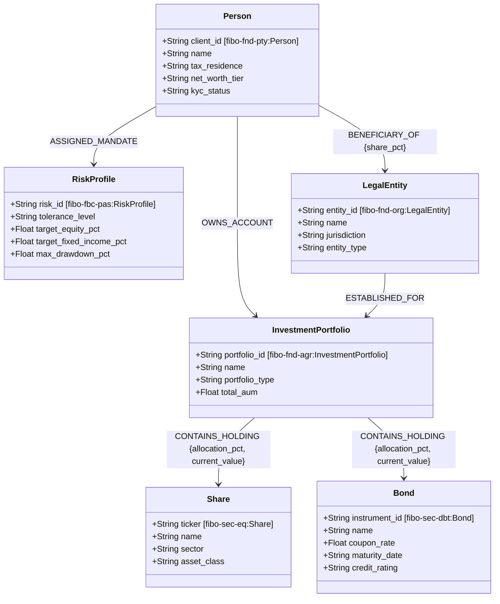
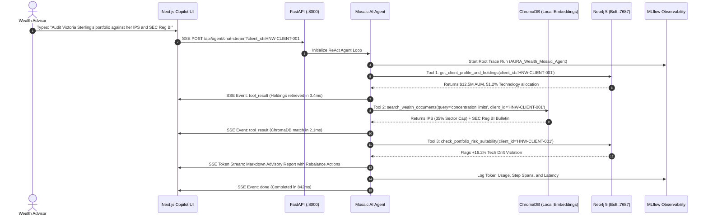

# AURA Wealth IQ: Deep Domain, Cypher Query & Codebase Master Reference
> **The Exhaustive, Line-by-Line Technical and Financial Ontology Guide.**  
> *Everything you need to master, explain, defend, and expand this platform.*

---

## 📑 Detailed Table of Contents

1. [Financial Domain Fundamentals: Wealth Management & Ontology](#1-financial-domain-fundamentals-wealth-management--ontology)
   - 1.1 High-Net-Worth (HNW) vs. Ultra-HNW (UHNW) Dynamics
   - 1.2 Investment Policy Statements (IPS) & Risk Mandates
   - 1.3 Regulatory Frameworks: SEC Regulation Best Interest (Reg BI) & MiFID II
   - 1.4 Estate Planning & Trust Structures (Delaware Trust Nexus)
2. [Why Hybrid Graph + Vector RAG is Required in Financial Advisory](#2-why-hybrid-graph--vector-rag-is-required-in-financial-advisory)
3. [FIBO (Financial Industry Business Ontology) Model Specification](#3-fibo-financial-industry-business-ontology-model-specification)
4. [W3C RDF/OWL 2 & SHACL Schema Validation (`fibo_wealth_ontology.ttl`)](#4-w3c-rdfowl-2--shacl-schema-validation)
5. [Client-Scoped ChromaDB Vector Store & Embeddings](#5-client-scoped-chromadb-vector-store--embeddings)
6. [Dynamic Text-to-Cypher Engine with AST Safety Guards](#6-dynamic-text-to-cypher-engine-with-ast-safety-guards)
7. [Databricks Unity Catalog 7-Tool Suite](#7-databricks-unity-catalog-7-tool-suite)
8. [End-to-End Codebase Walkthrough](#8-end-to-end-codebase-walkthrough)
   - 8.1 Connection Pooling (`backend/src/db/neo4j_client.py`)
   - 8.2 Databricks Unity Catalog Standards (`backend/src/tools/uc_portfolio_tools.py`)
   - 8.3 ChromaDB Vector Store (`backend/src/agent/wealth_vector_store.py`)
   - 8.4 Dynamic Text-to-Cypher (`backend/src/agent/text_to_cypher.py`)
   - 8.5 Multi-Hop Agentic RAG Engine (`backend/src/agent/agentic_rag.py`)
   - 8.6 FastAPI REST & SSE Bridge (`backend/src/api/app.py`)
   - 8.7 Next.js Institutional Frontend Components (`frontend/`)
9. [Complete Step-by-Step Request Execution Lifecycle](#9-complete-step-by-step-request-execution-lifecycle)
10. [Comprehensive Pitch, Defense & Interview Guide](#10-comprehensive-pitch-defense--interview-guide)

---

## 1. Financial Domain Fundamentals: Wealth Management & Ontology

### 1.1 High-Net-Worth (HNW) vs. Ultra-HNW (UHNW) Dynamics
In institutional wealth management, clients are categorized by investable liquid assets:
- **High-Net-Worth (HNW)**: \$1M to \$10M in investable assets (e.g. *Marcus Thorne* with \$6.0M AUM). Focus: capital preservation, tax efficiency, steady dividend/coupon yield, and retirement income.
- **Ultra-High-Net-Worth (UHNW)**: \$25M+ in total net worth (e.g. *Victoria Sterling* with \$12.5M in managed liquid flagship portfolios). Focus: multi-asset growth, alternative investments, private equity, tax nexus optimization, and multi-generational dynasty trusts.

---

### 1.2 Investment Policy Statements (IPS) & Risk Mandates
Every managed wealth account is legally bound by an **Investment Policy Statement (IPS)** and a **Risk Profile Mandate**:
- **Target Asset Allocation**: Strategic percentage split (e.g. 55% Equities, 35% Fixed Income, 10% Alternatives).
- **Maximum Drawdown**: Maximum allowable peak-to-trough portfolio decline (e.g. 18% for Moderate Growth, 8% for Conservative Capital Preservation).
- **Asset Allocation Drift**: Market fluctuations shift asset weights away from target mandates. When single-sector concentration exceeds allowable thresholds (e.g. >35.0%), advisors must execute **Portfolio Rebalancing**.

---

### 1.3 Regulatory Frameworks: SEC Regulation Best Interest (Reg BI) & MiFID II
- **SEC Regulation Best Interest (Exchange Act Rule 15l-1)**: Enforces Care, Disclosure, and Conflict Obligations. For a client categorized under Capital Preservation, holding over 35% in volatile equities constitutes an actionable regulatory breach.
- **MiFID II Suitability Directive**: European standard requiring explicit ESG preference capture and portfolio suitability scoring.

---

### 1.4 Estate Planning & Trust Structures (Delaware Trust Nexus)
UHNW clients utilize **Irrevocable Dynasty Trusts**:
- Victoria Sterling is the 100% beneficiary of **The Sterling Dynasty Irrevocable Trust** registered in **Delaware (`US-DE`)**.
- **Delaware Statutory Advantages**: Under 12 Del. C. Section 3303, Delaware trusts allow perpetual duration without Rule Against Perpetuities, shield out-of-state beneficiaries from state income taxes, and provide statutory asset protection.

---

## 2. Why Hybrid Graph + Vector RAG is Required in Financial Advisory

| Capability | Pure Vector RAG | Pure Knowledge Graph | Hybrid Graph + Vector RAG (AURA Wealth IQ) |
| :--- | :--- | :--- | :--- |
| **Arithmetic & Aggregations** | ❌ Fails on portfolio sums | ✅ Exact Cypher sums | ✅ Exact dollar calculations |
| **Multi-Hop Traversal** | ❌ Cannot trace 4 hops | ✅ Sub-ms multi-hop | ✅ Sub-ms multi-hop |
| **Unstructured Legal Reading** | ✅ Reads text chunks | ❌ Blind to unstructured PDFs | ✅ Reads SEC bulletins & IPS contracts |
| **Client Privacy Isolation** | ⚠️ Complex / prone to leak | ✅ Node-anchored isolation | ✅ Metadata-partitioned vector + graph isolation |
| **Regulatory Auditability** | ❌ Hallucinates opinions | ⚠️ Rigid without text citations | ✅ Deterministic graph metrics with legal citations |

---

## 3. FIBO (Financial Industry Business Ontology) Model Specification

Our Neo4j database strictly adopts the **EDMC FIBO standard** ontology classes:

---

## 4. W3C RDF/OWL 2 & SHACL Schema Validation

Located in [fibo_wealth_ontology.ttl](file:///Users/I8798/Desktop/Databricks%20POC/backend/src/ontology/fibo_wealth_ontology.ttl) and [fibo_shacl_validator.py](file:///Users/I8798/Desktop/Databricks%20POC/backend/src/ontology/fibo_shacl_validator.py).

### Enforced SHACL Node Shapes:
1. **`PersonShape`**:
   - `aura-wealth:clientId`: Mandatory, must match regex `^HNW-CLIENT-[0-9]{3}$`.
   - `aura-wealth:name`: Mandatory non-blank string.
   - `aura-wealth:taxResidence`: Mandatory for KYC / Reg BI compliance.
2. **`PortfolioShape`**:
   - `aura-wealth:portfolioId`: Mandatory unique identifier.
   - `aura-wealth:totalAUM`: Mandatory decimal $\ge 0.0$.
3. **`HoldingShape`**:
   - `aura-wealth:allocationPct`: Mandatory decimal $0.0 \le x \le 1.0$.
   - `aura-wealth:currentValue`: Mandatory decimal $\ge 0.0$.

---

## 5. Client-Scoped ChromaDB Vector Store & Embeddings

Located in [wealth_vector_store.py](file:///Users/I8798/Desktop/Databricks%20POC/backend/src/agent/wealth_vector_store.py).

- **Storage Engine**: Persistent ChromaDB (`./data/chroma_wealth_db`) with `LocalDenseEmbeddingFunction` (384 dimensions).
- **Client Metadata Partitioning**:
  $$\text{Search Scope}(C) = \{d \mid d.\text{client\_id} = C \lor d.\text{client\_id} = \text{"GLOBAL"}\}$$
- **Indexed Document Corpus**:
  - `SEC-REG-BI-2024-BULLETIN` (Rule 15l-1 Care & Concentration limits)
  - `IPS-VICTORIA-STERLING-2024` (Delaware Dynastic Trust, 55/35/10 target, 35% sector cap)
  - `IPS-MARCUS-THORNE-2024` (Florida Conservative Capital Preservation, 70% Fixed Income)
  - `10K-NVDA-RISK-2024` (BIS Semiconductor Export Licensing & Blackwell GPU Supply Chain)
  - `10K-AAPL-RISK-2024` (Single-source silicon supplier & cross-border tariff risk)
  - `DELAWARE-TRUST-CODE-T12` (Title 12 asset protection & perpetual dynastic duration)

---

## 6. Dynamic Text-to-Cypher Engine with AST Safety Guards

Located in [text_to_cypher.py](file:///Users/I8798/Desktop/Databricks%20POC/backend/src/agent/text_to_cypher.py).

- **AST Mutation Guard**: Validates that all generated Cypher queries begin with `MATCH` or `WITH`, and strictly regex-rejects mutation keywords:
  $$\text{Blocked Patterns} = \{\text{CREATE, MERGE, DELETE, DETACH, SET, REMOVE, DROP, ALTER, LOAD CSV, CALL dbms}\}$$
- **Latency Telemetry**: Returns execution latency in milliseconds alongside columns, row count, and tabular data.

---

## 7. Databricks Unity Catalog 7-Tool Suite

All functions are defined in [uc_portfolio_tools.py](file:///Users/I8798/Desktop/Databricks%20POC/backend/src/tools/uc_portfolio_tools.py) under catalog `wealth_mgmt_catalog.fibo_knowledge_graph`:

1. **`get_client_profile_and_holdings(client_id: str)`**
2. **`check_portfolio_risk_suitability(client_id: str, portfolio_id: Optional[str])`**
3. **`find_correlated_exposure(sector: str, min_allocation_pct: float = 0.05)`**
4. **`analyze_client_tax_and_trust_structure(client_id: str)`**
5. **`search_wealth_documents(query: str, client_id: Optional[str])`**
6. **`execute_dynamic_text_to_cypher(natural_query: str)`**
7. **`query_fibo_knowledge_graph(cypher_query: str)`**

---

## 8. End-to-End Codebase Walkthrough

### 8.1 Connection Pooling (`backend/src/db/neo4j_client.py`)
- Manages single-instance thread-safe Bolt connection pool with connection retry logic and read-only query execution.

### 8.2 Databricks Unity Catalog Standards (`backend/src/tools/uc_portfolio_tools.py`)
- Implements Pydantic response models and typed docstrings mapping to Databricks Unity Catalog functions.

### 8.3 ChromaDB Vector Store (`backend/src/agent/wealth_vector_store.py`)
- Houses persistent ChromaDB collections, local embedding vectorizers, and client-scoping metadata filters.

### 8.4 Dynamic Text-to-Cypher (`backend/src/agent/text_to_cypher.py`)
- Schema-aware natural language to Cypher translator with AST safety mutation guards and error handling.

### 8.5 Multi-Hop Agentic RAG Engine (`backend/src/agent/agentic_rag.py`)
- Implements ReAct agent reasoning loops, tool dispatch, SSE token streaming, and MLflow trace generation.

### 8.6 FastAPI REST & SSE Bridge (`backend/src/api/app.py`)
- Exposes async REST endpoints and Server-Sent Events (`/api/agent/chat-stream`) for streaming UI updates.

### 8.7 Next.js Institutional Frontend Components (`frontend/`)
- Modern React 18 / Next.js 14 frontend styled with responsive Tailwind CSS light/dark modes.

---

## 9. Complete Step-by-Step Request Execution Lifecycle

---

## 10. Comprehensive Pitch, Defense & Interview Guide

### Q1: Why not just use a standard Vector DB like Pinecone or ChromaDB alone?
**Answer**: Pure vector databases cannot do math across multi-hop relationships. They cannot compute total portfolio AUM, calculate single-sector percentage drift, or verify that Victoria Sterling is a 100% beneficiary of a Delaware trust. We use **Graph RAG (Neo4j)** for deterministic relationship math and **Vector RAG (ChromaDB)** for unstructured policy reading, creating a complete hybrid solution.

### Q2: How is client privacy guaranteed between High-Net-Worth accounts?
**Answer**: We implement a dual-layer isolation barrier:
1. **Graph Isolation**: All Cypher queries strictly bind to the active `{client_id}` parameter, preventing multi-tenant data bleed.
2. **Vector Metadata Scoping**: ChromaDB queries apply an explicit `client_id` filter allowing only documents belonging to the active client or global compliance regulations.

### Q3: How do you prevent hallucinated or destructive Cypher queries?
**Answer**: Our `text_to_cypher.py` engine incorporates an **AST Mutation Guard** that strictly rejects any query containing mutating keywords (`CREATE`, `MERGE`, `DELETE`, `DROP`, `SET`), ensuring all generated queries are 100% read-only.
