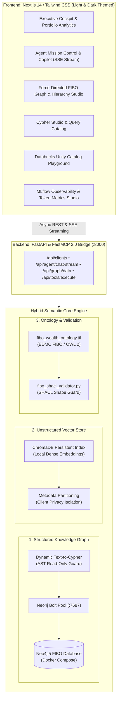

# AURA Wealth IQ — Autonomous Universal Risk & Advisory Platform
> **Enterprise Hybrid Graph & Vector RAG Platform for Institutional Wealth Management**  
> Powered by the **Financial Industry Business Ontology (FIBO)**, **Neo4j 5 Labeled Property Graph**, **ChromaDB Vector Store**, **W3C SHACL Validation**, and **Databricks Unity Catalog / Mosaic AI Agent Framework**.

---

## 🌟 What is AURA Wealth IQ?

**AURA Wealth IQ** (*Autonomous Universal Risk & Advisory*) is an enterprise AI decision-support platform engineered for Chief Investment Officers, Wealth Advisors, and Compliance Officers managing High-Net-Worth (HNW) and Ultra-HNW (UHNW) multi-asset portfolios.

Traditional RAG systems fail in wealth management because portfolio mandates, family trust structures, and regulatory rules (e.g., SEC Regulation Best Interest, MiFID II) require **multi-hop relational graph arithmetic** combined with **client-scoped unstructured document intelligence**—not simple text similarity search.

AURA Wealth IQ solves this through a **Hybrid Knowledge Architecture**:
1. **FIBO Knowledge Graph (Neo4j)** for multi-hop asset calculations, beneficial ownership, and deterministic portfolio drift.
2. **Native ChromaDB Vector Store** with local dense embeddings (`all-MiniLM-L6-v2`) for indexing SEC Reg BI bulletins, Client Investment Policy Statements (IPS), and 10-K risk filings.
3. **AST-Guarded Text-to-Cypher Engine** enabling safe, arbitrary ad-hoc natural language graph querying.
4. **W3C RDF/OWL 2 & SHACL Schema** enforcing institutional data quality and KYC constraints.
5. **Databricks Unity Catalog & FastMCP 2.0 Tools** tracked with live **MLflow Observability Traces**.

---

## 🏛️ System Architecture



---

## 🚀 Key Features & Capabilities

### 1. 📊 Executive Advisory Cockpit
- **Multi-Client Book Analytics**: Instant visibility into \$18.5M aggregate AUM across Ultra-HNW Victoria Sterling (\$12.5M) and Conservative Marcus Thorne (\$6.0M).
- **Multi-Asset Allocation Breakdown**: Interactive donut charts segmenting Equities, Fixed Income, Real Estate, and Private Equity.
- **Systemic Sector Concentration Screener**: Real-time identification of portfolio risk exposure and overweight alerts.
- **Portfolio Rebalance Simulator**: Sliders to simulate asset shifts and compute real-time expected return and volatility impact.

### 2. 🤖 Mosaic AI Copilot with Streaming Reasoning
- **Live SSE Token Streaming**: Token-by-token advisory responses with markdown rendering and execution timeline.
- **MLflow Observability Studio**: Real-time visibility into tool arguments, query latency (ms), token usage, and status badges.
- **Unified Master-Detail Tracing**: Step-by-step expandable cards showing `PLAN`, `TOOL_CALL`, `OBSERVATION`, and `SYNTHESIS`.

### 3. ⚡ Dynamic Text-to-Cypher Engine
- **Natural Language Translation**: Automatically compiles arbitrary natural language questions into optimized Neo4j Cypher.
- **AST Mutation Safety Guard**: Strictly blocks destructive operations (`CREATE`, `MERGE`, `DELETE`, `DETACH`, `SET`, `DROP`, `CALL dbms`).
- **Sub-Millisecond Execution**: Queries Neo4j directly and returns formatted tabular records with execution telemetry.

### 4. 📄 Client-Scoped Hybrid Vector Store (ChromaDB)
- **Local Dense Embeddings**: Runs 100% offline using `all-MiniLM-L6-v2` dense vector embeddings.
- **Explicit Client Privacy Scoping**: Metadata partitioning ensures private client Investment Policy Statements (IPS) never leak across client boundaries.
- **Indexed Knowledge Base**: SEC Reg BI Rule 15l-1 Bulletins, Victoria Sterling Delaware IPS, Marcus Thorne Florida IPS, and NVIDIA/Apple Form 10-K risk disclosures.

### 5. 🛡️ Formal FIBO OWL 2 & SHACL Validation
- **W3C RDF/OWL 2 Schema (`fibo_wealth_ontology.ttl`)**: Formal class hierarchy for `Person`, `InvestmentPortfolio`, `Holding`, `Share`, `Bond`, and `LegalEntity`.
- **SHACL Quality Guard (`fibo_shacl_validator.py`)**: Rejects invalid incoming data (missing KYC domicile, negative AUM, or out-of-bound allocation weights).

### 6. 🛠️ Databricks Unity Catalog 7-Tool Suite
1. **`get_client_profile_and_holdings(client_id)`**: Retrieves comprehensive client profile and portfolio asset breakdown.
2. **`check_portfolio_risk_suitability(client_id, portfolio_id)`**: Audits portfolio drift and SEC Reg BI compliance.
3. **`find_correlated_exposure(sector, min_allocation_pct)`**: Screens multi-client book for systemic concentration risk.
4. **`analyze_client_tax_and_trust_structure(client_id)`**: Maps Delaware trusts, tax domicile, and beneficial owner stakes.
5. **`search_wealth_documents(query, client_id)`**: ChromaDB vector search across SEC bulletins and client IPS contracts.
6. **`execute_dynamic_text_to_cypher(natural_query)`**: Safe natural language to Cypher translator and executor.
7. **`query_fibo_knowledge_graph(cypher_query)`**: Direct read-only Cypher query executor.

---

## 📋 Prerequisites

Ensure your environment has:
- **Docker & Docker Compose** (for the Neo4j database container)
- **Python 3.10+** (Python 3.11, 3.12, 3.13, or 3.14)
- **Node.js v18+** (with `npm`)

---

## ⚡ Quick Start Guide

### Step 1: Start Neo4j Database
```bash
cd backend
docker compose up -d
```
> Verify Neo4j is running at `http://localhost:7474` (Default User: `neo4j`, Password: `password123`).

### Step 2: Seed the FIBO Knowledge Graph
```bash
# In backend/
source ../.venv/bin/activate
python src/knowledge_graph/seed_fibo.py
```

### Step 3: Start the Backend FastAPI Service
```bash
# In backend/
source ../.venv/bin/activate
uvicorn src.api.app:app --host 0.0.0.0 --port 8000 --reload
```
> Verify API health at `http://localhost:8000/api/health`.

### Step 4: Start the Next.js Frontend
```bash
cd ../frontend
npm run dev
```
> Open **AURA Wealth IQ** at `http://localhost:3000`.

---

## 🧪 Running Automated Tests

Run the full backend test suite:
```bash
source .venv/bin/activate
cd backend
pytest tests/test_text_to_cypher.py tests/test_wealth_vector_store.py tests/test_fibo_shacl.py
```

Verify frontend TypeScript compilation:
```bash
cd frontend
npx tsc --noEmit
```

---

## 📁 Repository Structure

```text
Databricks POC/
├── backend/
│   ├── data/chroma_wealth_db/          # Persistent ChromaDB vector index
│   ├── src/
│   │   ├── agent/
│   │   │   ├── agentic_rag.py          # Mosaic AI Agent & SSE streaming logic
│   │   │   ├── text_to_cypher.py       # Dynamic Text-to-Cypher engine with AST guards
│   │   │   └── wealth_vector_store.py  # ChromaDB client-scoped vector store
│   │   ├── api/
│   │   │   └── app.py                  # FastAPI REST and SSE streaming endpoints
│   │   ├── db/
│   │   │   └── neo4j_client.py         # Bolt connection pool & Cypher executor
│   │   ├── ontology/
│   │   │   ├── fibo_wealth_ontology.ttl# W3C RDF/OWL 2 FIBO Ontology & SHACL Shapes
│   │   │   └── fibo_shacl_validator.py # Python SHACL data quality validator
│   │   └── tools/
│   │       └── uc_portfolio_tools.py   # Databricks Unity Catalog 7-Tool Suite
│   └── tests/                          # Pytest test suites
├── frontend/
│   ├── app/                            # Next.js 14 App Router & layout
│   ├── components/                     # Institutional UI components (Light/Dark)
│   └── public/                         # Static assets
├── COMPLETE_ARCHITECTURE_AND_CODE_GUIDE.md # Exhaustive master reference
└── README.md                           # This guide
```
