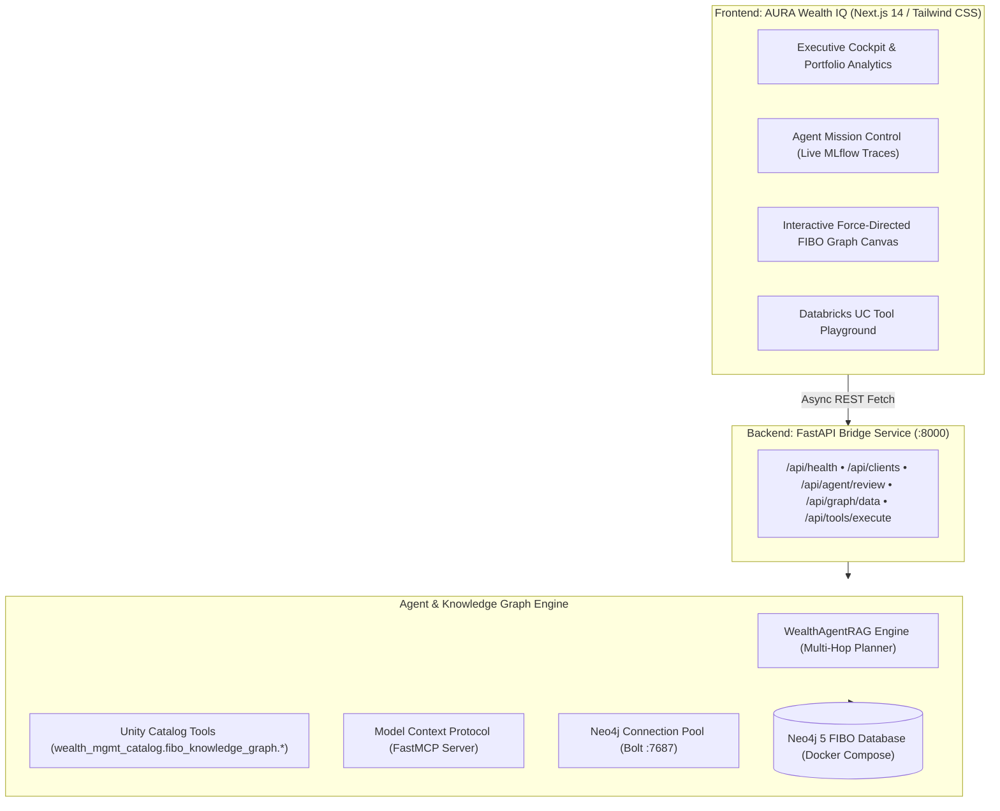

# AURA Wealth IQ — Autonomous Universal Risk & Advisory Platform
> **Enterprise Agentic RAG Platform for Wealth Management**  
> Powered by the **Financial Industry Business Ontology (FIBO)**, **Neo4j Graph Database**, and **Databricks Unity Catalog / Mosaic AI Agent Framework**.

---

## 🌟 What is AURA Wealth IQ?

**AURA Wealth IQ** (*Autonomous Universal Risk & Advisory*) is an enterprise-grade AI decision-support platform engineered for chief investment officers, wealth advisors, and compliance teams managing High-Net-Worth (HNW) portfolios.

Traditional RAG systems fail in wealth management because portfolio rules, family trust structures, and regulatory mandates (e.g., SEC Regulation Best Interest, MiFID II) require **multi-hop relational reasoning** across interconnected entities—not simple text semantic search.

AURA Wealth IQ solves this by grounding an autonomous AI agent in a **FIBO-compliant Knowledge Graph** and orchestrating queries through governed **Databricks Unity Catalog Tools** and the **Model Context Protocol (MCP)**.

---

## 🏛️ System Architecture



---

## 🚀 Key Features & Capabilities

### 1. 📊 Executive Advisory Cockpit
- **Live Multi-Client Book Metrics**: Instant visibility into \$18.5M aggregate AUM across Ultra-HNW Victoria Sterling (\$12.5M) and Conservative Marcus Thorne (\$6.0M).
- **FIBO Asset Allocation Analytics**: Interactive donut charts segmenting Equities, Fixed Income, Real Estate, and Private Equity.
- **Systemic Sector Concentration Screener**: Real-time identification of portfolio risk exposure and overweight alerts.
- **Regulatory Suitability Scorecard**: Real-time compliance auditing under SEC Regulation Best Interest (`POL-REG-BI-2024`) and MiFID II.

### 2. 🧠 Mosaic AI Agent Mission Control
- **One-Click Autonomous Review**: Multi-hop agent reasoning traversing client profiles, investment mandates, estate trusts, and asset volatility.
- **Transparent Chain-of-Thought Tracing**:
  - `[PLAN]` Formulates graph retrieval strategy.
  - `[TOOL_CALL]` Invokes Databricks Unity Catalog functions.
  - `[OBSERVATION]` Ingests and processes multi-asset graph records.
  - `[SYNTHESIS]` Compiles actionable rebalancing notices and compliance checks.
- **Inspectable Payloads**: Collapsible JSON inspector for every intermediate reasoning step (compatible with **MLflow Tracing**).

### 3. 🕸️ Interactive FIBO Knowledge Graph Canvas
- **Force-Directed Physics Simulation**: Explore nodes and relationships in a real-time interactive canvas with zoom, pan, and node-dragging physics.
- **Color-Coded Ontology Classes**:
  - 🟢 **Person**: `fibo-fnd-pty:Person` (Clients)
  - 🔵 **Portfolio**: `fibo-fnd-agr:InvestmentPortfolio` (Discretionary & Advisory Accounts)
  - 🟡 **Equity**: `fibo-sec-eq:Share` (AAPL, MSFT, NVDA, JPM, LLY)
  - 🟣 **Bond**: `fibo-sec-dbt:Bond` (US Treasuries, Corporate Senior Notes)
  - 🌸 **Alternative**: `fibo-der-alt:AlternativeAsset` (Venture Capital & Real Estate Funds)
  - 🔷 **Trust**: `fibo-fnd-org:LegalEntity` (Irrevocable Trusts & Family Offices)
  - 🔴 **Compliance**: `fibo-reg-rep:CompliancePolicy` (Regulatory Rules)
- **Node Inspector Sidebar**: Click any graph node to inspect its raw FIBO ontology schema attributes.

### 4. 🛠️ Databricks Unity Catalog & MCP Playground
- **Live Tool Catalog**: Discover and test all 5 Python functions registered under `wealth_mgmt_catalog.fibo_knowledge_graph.*`.
- **Interactive Execution**: Run custom JSON parameters and inspect real-time query responses with safety mutation guards.

---

## 📋 Prerequisites

Before running the product, ensure your environment has:
- **Docker & Docker Compose** (for the Neo4j database container)
- **Python 3.10+** (Python 3.11, 3.12, 3.13, or 3.14)
- **Node.js v18+** (with `npm`)

---

## ⚡ Step-by-Step Installation & Usage Guide

### Step 1: Start the Neo4j Graph Database
From the project root:
```bash
cd backend
docker compose up -d
```
> Verify Neo4j is running at `http://localhost:7474` (Default User: `neo4j`, Password: `password123`).

---

### Step 2: Set Up Python Backend & Seed Database
In the `backend/` directory:

```bash
# 1. Create and activate a virtual environment
python3 -m venv ../.venv
source ../.venv/bin/activate

# 2. Install backend dependencies
pip install -r requirements.txt

# 3. Seed FIBO Schema & Synthetic Wealth Dataset
python seed_db.py
```

**Expected Seeding Output:**
```
Connecting to Neo4j graph database...
Connected to Neo4j successfully on attempt 1.
Applying FIBO schema constraints...
Constraints applied.
Seeding FIBO Wealth Management data...
Seed data successfully ingested.

--- Knowledge Graph Summary (Nodes) ---
Labels: ['fibo-sec-eq:Share', 'FinancialInstrument', 'Share'] -> Count: 5
Labels: ['fibo-fbc-pas:RiskProfile', 'RiskProfile'] -> Count: 2
Labels: ['fibo-fnd-agr:InvestmentPortfolio', 'InvestmentPortfolio'] -> Count: 2
Labels: ['fibo-reg-rep:CompliancePolicy', 'CompliancePolicy'] -> Count: 2
Labels: ['fibo-sec-dbt:Bond', 'FinancialInstrument', 'Bond'] -> Count: 2
Labels: ['fibo-der-alt:AlternativeAsset', 'FinancialInstrument', 'AlternativeAsset'] -> Count: 2
Labels: ['fibo-fnd-pty:Person', 'Person'] -> Count: 2
Labels: ['fibo-fnd-org:LegalEntity', 'LegalEntity'] -> Count: 1
```

---

### Step 3: Launch the FastAPI Backend Service
Still in the `backend/` directory:

```bash
uvicorn src.api.app:app --host 0.0.0.0 --port 8000 --reload
```
- **Backend API**: `http://localhost:8000`
- **Interactive Swagger Docs**: `http://localhost:8000/docs`

---

### Step 4: Launch the Next.js Frontend Application
Open a **new terminal window** and run:

```bash
cd frontend
npm install
npm run dev
```

Open **`http://localhost:3000`** in your browser to access the complete **AURA Wealth IQ** platform!

---

## 🔌 Connecting Google Antigravity & AI Agents via MCP

You can connect **Google Antigravity**, **Claude Desktop**, or any **Model Context Protocol (MCP)** client directly to this local FIBO knowledge graph.

### Antigravity / MCP Server Settings
Add the following snippet to your MCP server configuration:

```json
{
  "mcpServers": {
    "fibo-wealth-mcp": {
      "command": "/Users/I8798/Desktop/Databricks POC/.venv/bin/python",
      "args": [
        "/Users/I8798/Desktop/Databricks POC/backend/src/mcp_server/server.py"
      ],
      "env": {
        "NEO4J_URI": "bolt://localhost:7687",
        "NEO4J_USER": "neo4j",
        "NEO4J_PASSWORD": "password123"
      }
    }
  }
}
```

### Excluded & Available Tools in MCP
| Tool Name | Purpose |
| :--- | :--- |
| `get_client_profile_and_holdings` | Multi-hop graph query resolving client metadata, risk mandate, and portfolio holdings. |
| `check_portfolio_risk_suitability` | Audits actual asset allocations against client risk mandate and regulatory rules. |
| `find_correlated_exposure` | Evaluates systemic risk and book-wide sector concentration. |
| `analyze_client_tax_and_trust_structure` | Resolves multi-entity wealth structures, irrevocable trusts, and estate stakes. |
| `query_fibo_knowledge_graph` | Controlled Cypher query executor with strict mutation guardrails. |

---

## 🧪 Testing & Quality Assurance

### Run the Backend Pytest Suite
In `backend/`:
```bash
../.venv/bin/pytest tests/ -v
```
All **18 automated tests** validate schema constraints, graph relationships, Databricks UC functions, and FastAPI endpoints:
```
============================== 18 passed in 2.15s ==============================
```

### Validate Frontend Production Build
In `frontend/`:
```bash
npm run build
```
Ensures 0 TypeScript, ESLint, or JSX bundle compilation issues.

---

## ☁️ Databricks Migration Blueprint (Mosaic AI & Unity Catalog)

When deploying to **Databricks**:

1. **Unity Catalog Registration**:
   Register the Python functions in `backend/src/tools/uc_portfolio_tools.py` into your Databricks workspace under `wealth_mgmt_catalog.fibo_knowledge_graph.*` using the Databricks SDK:
   ```python
   from databricks.sdk import WorkspaceClient
   w = WorkspaceClient()
   # Register catalog.schema.function_name
   ```

2. **Mosaic AI Agent Deployment**:
   Wrap the agent using the `@uc_function` / MLflow Agent SDK to deploy as an endpoint on **Databricks Model Serving**, with automated **MLflow Tracing** and governance out-of-the-box.

---

## 📁 Repository Layout

```
Databricks POC/
├── backend/
│   ├── docker-compose.yml         # Neo4j 5 + APOC container service
│   ├── requirements.txt           # Python dependencies (fastapi, neo4j, mcp, pydantic, mlflow)
│   ├── .env.example               # Backend environment template
│   ├── .env                       # Local backend environment
│   ├── seed_db.py                 # FIBO constraint & synthetic HNW data seeder
│   ├── run_agent_demo.py          # CLI demonstration & trace generator
│   ├── agent_execution_logs.json  # Multi-hop agent execution logs
│   ├── schema/
│   │   ├── fibo_constraints.cypher# FIBO uniqueness constraints & indexes
│   │   └── fibo_seed_wealth.cypher# Synthetic HNW dataset (Clients, Portfolios, Instruments)
│   ├── src/
│   │   ├── db/
│   │   │   └── neo4j_client.py    # Neo4j connection pool and query executor
│   │   ├── tools/
│   │   │   └── uc_portfolio_tools.py # Databricks Unity Catalog functions
│   │   ├── mcp_server/
│   │   │   └── server.py          # FastMCP server exposing UC tools
│   │   ├── agent/
│   │   │   └── agentic_rag.py     # Mosaic AI-compatible agent engine
│   │   └── api/
│   │       └── app.py             # FastAPI backend REST service
│   └── tests/                     # 18 Pytest unit & integration tests
│       ├── test_api.py            # FastAPI endpoint tests
│       ├── test_graph_schema.py   # Schema & node integrity tests
│       ├── test_uc_tools.py       # Unity Catalog tool unit tests
│       └── test_agent_navigation.py # End-to-end agent reasoning tests
│
├── frontend/
│   ├── package.json               # Next.js 14, React 18, Tailwind, Lucide, Recharts
│   ├── tailwind.config.ts         # Dark obsidian/emerald theme
│   ├── app/
│   │   ├── layout.tsx             # Root application shell
│   │   ├── globals.css            # Dark glassmorphism styles
│   │   └── page.tsx               # Main AURA Wealth IQ cockpit view
│   └── components/
│       ├── Navbar.tsx             # System health status & client switcher
│       ├── ExecutiveDashboard.tsx # AUM metrics, asset donut & sector bars
│       ├── AgentMissionControl.tsx# Step-by-step reasoning traces & synthesis
│       ├── GraphCanvas.tsx        # Interactive force-directed graph canvas
│       └── UCToolRegistry.tsx     # Databricks UC tool testing playground
│
└── README.md                      # Complete product documentation
```

---

## 🛠️ Frequently Asked Questions & Troubleshooting

- **Port 7687 / 7474 already in use**:
  Ensure no background Neo4j services are running, or change the port mapping in `backend/docker-compose.yml` and update `NEO4J_URI` in `backend/.env`.
- **How do I reset or re-seed the graph?**:
  Simply re-run `python seed_db.py` in the `backend/` directory. It safely clears existing nodes and re-applies all FIBO constraints and seed entities.
- **How do I stop all services?**:
  ```bash
  cd backend && docker compose down
  ```
